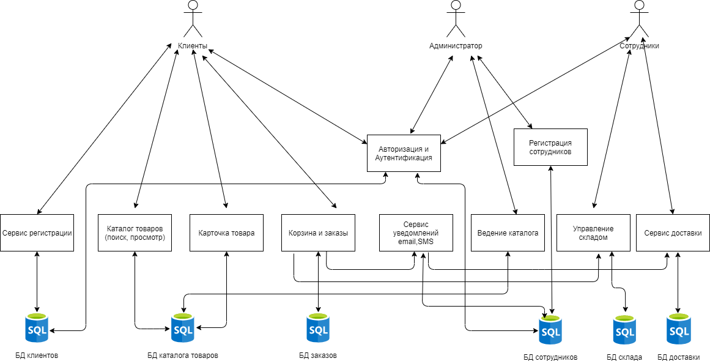

# bookstore
Описание проeкта.
Проект книжного интернет магазина.
Разбил монолит на несколько микросервисов:
1. Сервис регистрации новых пользователей.
2. Сервис регистрации новых сотрудников магазина.
3. Сервис авторизации и аутинтефикации.
4. Сервис каталога книг.
    В этом сервисе будет осуществлятся просмотр каталогов, книг, их поиск.
    (Возможно этот сервис нужно объежиниить с "Сервисом управления складом")
5. Сервис карточки товара.
    отображение информации о книге.Название, цена, издатель, наличие и т.д.
6. Сервис управления корзиной и заказами.
    в этом сервисе будет осуществлятся работа с заказом, начиная от заполнения корзины до доставки.
7. Сервис уведомлений(email,SMS ...).
    уведомление о изменениях в заказе.
8. Ведение каталога товаров.
    Административеный сервис для сотрудников , для заведения новых книг, изменения информации по ним и т.д.
9. Сервис управления складом.
    Сервис учета книг на складе, кол-во , цена и т.д.
     (Возможно этот сервис нужно объежиниить с "Сервисом каталога книг") 
10. Сервис доставки.
      Сервис службы доставки. Сообщение о движении товара от склада к клинту, назначение курьера или доставка до пункта самовывоза.

[Текущая архитектура](Architecture_v3.png)

