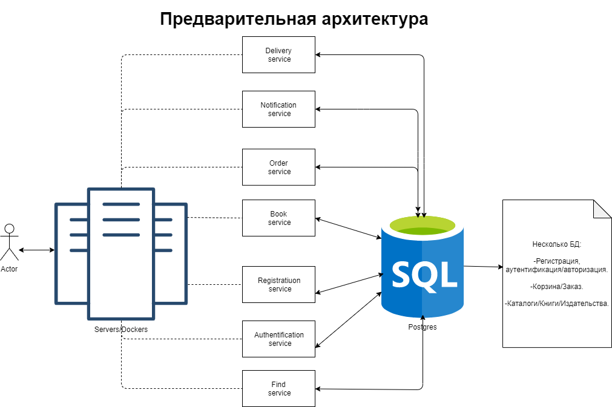

# bookstore
Описание проeкта.
Проект книжного интернет магазина.
В рамках курса будет реализованно следующее.
1. Регистрация пользователя,аутентификация и авторизация.
2. Административная часть для ведения каталога книг, издательств.
3. Просмотр, поиск, выбор книг и формирование заказа.
4. Сервис доставки.
5. Рассылка уведомлений о заказе.
6. История заказов.
7. Frontend пока под вопросом - недостаточно компетенций, если будет время - сделаю.

Сборка и запуск проекта
1. скачать этот репозиторий в любую папку 
  <b>'git clone https://github.com/rubanovmaxim/docker_init.git -b homework_9' . </b>
2. Перейти в корень репозитория.
3. Запустить <b>docker-compose up</b>

после старта сервера:</b>
 для просмотра grafana пройти по ссылке:</b>
 http://127.0.0.1:3000/</b>
 логин : admin</b>
 psaaword : pass</b>

[Предварительная архитектура](Architecture_v1.png)

[Диаграмма взаимодействий](BookStore.png)

